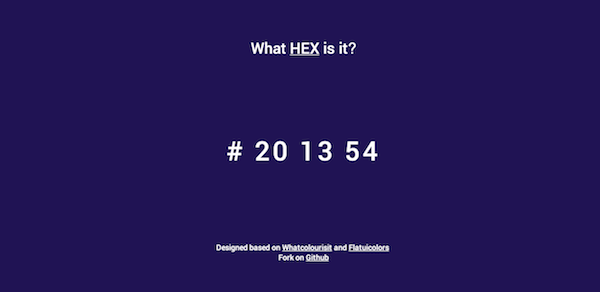

#ColorClock  
**[Demo](https://colorclock.herokuapp.com/)**
==========
  

##Details
- Click on header to change between HEX and RGB code.  
- Click on code to copy to clipboard. (PC only)  
- Designed based on [Whatcolourisit](http://whatcolourisit.scn9a.org) and [Flatuicolors](http://flatuicolors.com). 

##Tools
- [JQuery](http://jquery.com/)
- [Zeroclipboard](https://github.com/zeroclipboard/zeroclipboard/)
- [Google Fonts (Roboto)](http://www.google.com/fonts/specimen/Roboto/)
